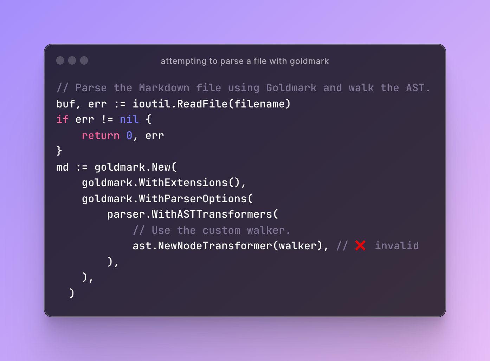

## Examples Where ChatGPT Failed

??? example "Help Me With Using Goldmark For Markdown Parsing"

    This failed repeatedly.
    The code examples were promising but made up quite a few methods and approaches that were non-existent in the actual code base and had no code examples matching in the repo.
    Goldmark doesn't have a lot of use examples compared to many projects, so I think the quality of the suggestions degraded with a broader question.

    It _looked_ great, but with improper method signatures it really suffered.

    { loading=lazy }

    I think for this to succeed I'm going to have to it focus on a specific code block and not a function in it's entirety.

## Examples Where ChatGPT Has Been Amazing

👉 See [anonymous server](../go/http.md#anonymous-server)

??? example "Help Me Jump Start an API Server With TDD Support and Zerolog"

    > What's a good bootstrap template for golang rest api server.
    > I want to include TDD approach that abstracts the http server into a cmd file and allows me to mock http for tests.
    > Use zerolog for logging with context.

    Key points I think this did well with.

    1. It structured it reasonsably.
    2. It provided a jump start test file to do TDD with based on `httptest`.
    3. It was intelligent enough to add `zerolog` url handling logging using my preferred package.

    I could see how this could really help jump start intelligently templating out a project much better than just raw boilerplate.

    Instead of having to maintain cookiecutter style templates, you might see the future allowing being really specific and generating customized code along with infra to support a quicker iteration on development.
    Of course, everything should be vetted and scanned, but it's a pretty incredible experience and worth using copilot/chatGPT to occasionally accelerate development.

    ChatGPT's answer:

    There are several good bootstrap templates available for Go REST API servers. One popular option is the Go kit template, which provides a clean architecture for building microservices in Go.
    Another option is the Gin Gonic template, which is a lightweight and fast HTTP web framework.
    For your specific requirements, I would recommend using the Gin Gonic template, which provides a simple and easy-to-use web framework. You can use the gin package to create an HTTP server and handle requests, and use the zerolog package to log requests and responses.

    Here's an example of how you can structure your project using the Gin Gonic template and implement TDD:

    4. Start by creating a new project using the Gin Gonic template: `go get github.com/gin-gonic/gin`
    5. Create a new cmd directory in your project root and create a main.go file inside it:
    6. This file sets up a basic HTTP server using the `api.NewServer` function, which we'll define in the next step.
       It also initializes a logger using the `logging.NewLogger` function.
    7. Create a new api directory and create a `server.go` file inside it.
       This file defines a Server struct that holds a reference to our logger.
       We'll use this struct to handle HTTP requests in the ServeHTTP method.
    8. Now you can implement your TDD approach by writing tests and mocking the HTTP server using the `httptest` package:
    9. This test creates a new instance of our Server and mocks an HTTP request using the `httptest` package.
       It then calls the `ServeHTTP` method and checks that the response status code is `200` OK.
    10. Finally, you can use the zerolog package to log requests and responses in the ServeHTTP method.

    === "cmd/main.go"

        ```go title="cmd/main.go"
        package main

        import (
            "net/http"
            "os"
            "your_project/api"
            "your_project/logging"
        )

        func main() {
          logger := logging.NewLogger()
          defer logger.Sync()

          // Initialize the HTTP server
          server := api.NewServer(logger)

          // Start the server
          port := os.Getenv("PORT")
          if port == "" {
              port = "8080"
          }

          logger.Info().Msgf("Starting server on port %s...", port)
          if err := http.ListenAndServe(":"+port, server); err != nil {
              logger.Fatal().Err(err).Msg("Failed to start server")
          }
        }
        ```

    === "api/server.go"

        ```go title="api/server.go"
        package api

        import (
            "net/http"
            "your_project/logging"
        )

        type Server struct {
            logger *logging.Logger
        }

        func NewServer(logger *logging.Logger) *Server {
            return &Server{logger: logger}
        }

        func (s *Server) ServeHTTP(w http.ResponseWriter, r *http.Request) {
            // Handle the request
        }

        func (s *Server) ServeHTTP(w http.ResponseWriter, r *http.Request) {
            s.logger.Info().
                Str("method", r.Method).
                Str("path", r.URL.Path).
        }
        ```

    === "api/server_test.go"

        ```go title="api/server_test.go"
        package api_test

        import (
            "net/http/httptest"
            "testing"
            "your_project/api"
            "your_project/logging"
        )

        func TestServer_ServeHTTP(t *testing.T) {
            logger := logging.NewLogger()
            defer logger.Sync()

            server := api.NewServer(logger)

            req := httptest.NewRequest("GET", "/", nil)
            w := httptest.NewRecorder()

            server.ServeHTTP(w, req)

            resp := w.Result()
            if resp.StatusCode != http.StatusOK {
                t.Errorf("unexpected status code: %d", resp.StatusCode)
            }
        }
        ```
