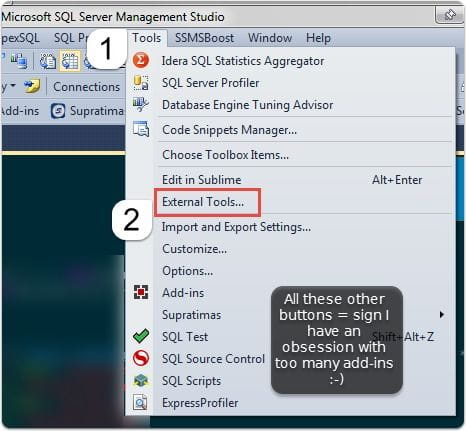
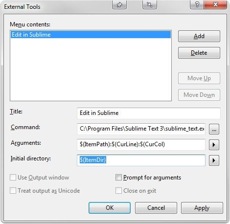
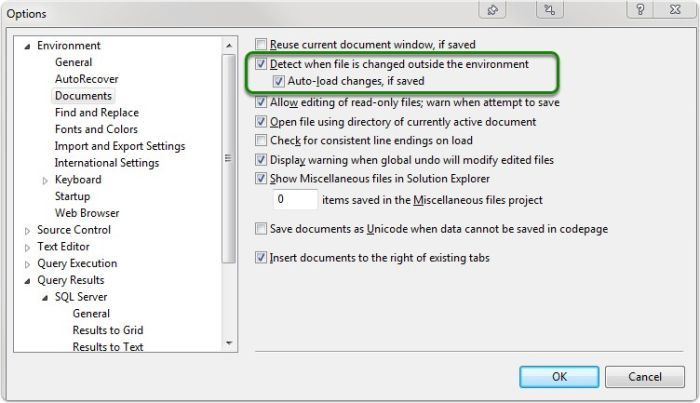

My preview post showed a demonstration of the multi-cursor editing power of Sublime Text 3 when speeding up your coding with SQL server.There is a pretty straight forward way to setup sublime (or one of your preferred text editors) to open the same file you are editing in SQL Management Studio without much hassle. I find this helpful when the type of editing might benefit from some of the fantastic functionality in Sublime.

## External Tool Menu

Go to `Tools > External Tools`

## Setup Sublime Commands to Open

<table data-preserve-html-node="true">
<tbody><tr data-preserve-html-node="true">
<th data-preserve-html-node="true">Setting</th>
<th data-preserve-html-node="true">Value</th>
</tr>
<tr data-preserve-html-node="true">
<td data-preserve-html-node="true">Title</td>
<td data-preserve-html-node="true">Edit in Sublime</td>
</tr>
<tr data-preserve-html-node="true">
<td data-preserve-html-node="true">Command</td>
<td data-preserve-html-node="true">C:\Program Files\Sublime Text 3\sublime_text.exe</td>
</tr>
<tr data-preserve-html-node="true">
<td data-preserve-html-node="true">Arguments</td>
<td data-preserve-html-node="true">$(ItemPath):$(CurLine):$(CurCol)</td>
</tr>
<tr data-preserve-html-node="true">
<td data-preserve-html-node="true">Initial Directory</td>
<td data-preserve-html-node="true">$(ItemDir)</td>
</tr>
</tbody></table>

_Limitation: Unsaved temporary files from SSMS are empty when you navigate to them. If you save the SQL file you will be able to correctly switch to the file in Sublime and edit in Sublime and SSMS together._

**Important:**
One thing I personally experienced that wasn't consistent was the handling of unsaved files. If the file is SqlQuery as a temp file that hasn't been saved, then this opening didn't work for me. Once I had the file named/saved, it worked perfectly, even bringing the cursor position in Sublime to match what was currently in SSMS.

## Refresh File3

`Tools > Options > Environment > Documents`
You can setup the auto-refresh to be in the background if you wish, or manually select the refresh from SSMS when it detects the change. If the auto-refresh happens while you are editing sometimes it caused me to have redo some work (or control-z) in Sublime, but for the most part it's pretty seamless.

