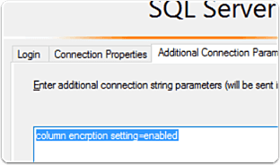

These are notes taken from the [Houston SQL Pass User group from July](http://houston.sqlpass.org/Home.aspx?EventID=5496). This presentation was given by John Cook, (Data Platform Solution Architect Microsoft) who did a great job with limited time on providing some great details on the new functionality with SQL 2016. To follow him, take a look at sqlblog.com where he posts or follow him on twitter. Thanks to him for the overview.

> ####
> JohnPaulCook (@JohnPaulCook) on Twitter
>
> Microsoft Data Platform specialist and Registered Nurse

> ####
> John Paul Cook Sql Blog (No Link)
>
> SQL Blog - Blogs about SQL Server, T-SQL, CLR, Service Broker, Integration Services, Reporting, Analysis Services, Business Intelligence, XML, SQL Scripts, best practices, database development, database administration, and programming

## cloud first

Most of the new features included in 2016 have been tested in the cloud. They are implementing cloud-first with features. Therefore, most on prem features have been throughly tested in the new world, sometimes even up to months.

## dynamic data masking

1.  If you know a specific value you could get the results back in a specific query by putting in where clause. This would retrieve the row masked, but you still knew the results due to this "brute force attack". Dealing with security means you'd prevent adhoc queries anyway. You want to ensure that that scenario doesn't happen.
2.  This would be categorized more as obfuscation. This is not the same as encryption.
3.  New grant permission for UNMASK

## encryption

1.  Encryption at column level
2.  Deterministic: need this for being able to search/join among different tables
3.  Random: Good for increasing the difficulty of breaking the encryption.
4.  Encryption increases to the size of the data, taking up more size
5.  Has some limitations on Collation. The example was COLLATE Latin_General_BIN2
6.  This is offloaded to the client which converts the value with ado.net 4.6.1. This means a certain compatibility would need to be maintained to use this with legacy applications. This is done on the client. Unless you give the key to the dba, they can't see the information.
7.  Additional connection string value is required, per SSMS has to convert and interpret this value.

`column encryption setting=enabled`

## stretch

Stretch is more "stretch table" to Azure. This means you'd bind a function to your sql server with the logic to archive. This would let you store very cold data without having to maintain locally.
Another positive to this is that each table is contained as it's own "database" in Azure. They maintain the backups for you, so your backup windows are not impacted. You only have to backup the local data.

## Temporal Database

Microsoft keeps track of all your changes in a table. You have to enable on each table individually. This functionality stores the history of all changes to ensure this history is tracked. This used to require a lot of coding.
