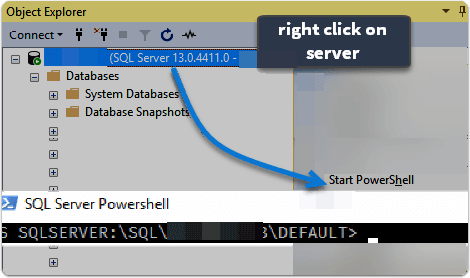


I don't use these much, if any now. Check out dbatools which is a much better module with a full range of features to save you a ton of time.


# simple setup

A major improvement that seems to have quietly slipped into the sql developers world is an improved SQLServer powershell module. The improved module is finally available in the powershell gallery, allowing a super quick setup on a server. No more installing SSMS to get them!

This is very promising, and great if you want to leverage some of the functionality on various build servers, or other machines that might not have SSMS installed.

[Powershell Gallery - SqlServer](http://bit.ly/2pOwVtj)

# new cmdlets

In reviewing, I ran across a few new cmdlet's as well. For instance, you could easily right click on a table and output the results into a powershell object, json, csv, gridview, or anything else you want. This is great flexibility.

In versions of SQL Server (as of 2012 or earlier) I believe the version SQL Server was utilizing was out of date with the installed version. For instance, on Windows Server 2012 with Powershell ISE reporting PsVersion of 4.0, Sql Server reported version 2.0 being utilized.

In 2014 instances I had, the powershell invoked from SSMS shows the matching up to date version, which gives much better capability and functionality.

# simple benefits for the inquiring mind

If you are not familar with the potentional benefits from being able to quickly invoke a powershell prompt and use SQL server cmdlets (prebuilt functionality that is easily called), I can give you a few use cases.

If you were asked to run a query, then export the results to a spreadsheet, it would be relatively simple as a cut and paste. However, if you needed to loop through every table in the database, and put each one to it's own excel workbook, powershell would allow you to quickly loop, convert the datatable returned into an excel worksheet, and either append into new worksheets, or create completely seperate new files. For automation possibilities, you've got a tremendous amount of potentional time savings if you can get comfortable with powershell.

In my case, I've found Powershell to be a great tool to help me understand more of the .NET framework as I use various cmdlets or .NET accelerators.
