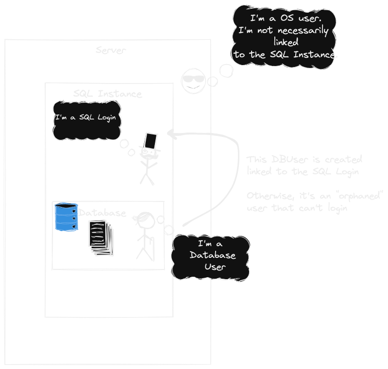

## Confusing

As I've worked with folks using other database engines, I've realized that Microsoft SQL Server has some terminology and handling that is a bit confusing.
Here's my attempt to clarify the basics for myself and others needing a quick overview.
This is not comprehensive coverage of security architecture, which is a very complex topic, more just terminology.

## Terminology

Note that it's best to consider SQL Server as it's own operating system, not just a standard application running.
It has its own memory manage, cpu optimization, user security model, and more.
It's helpful in understanding why a `Server Login != Instance Login` by reviewing common terminology.
I've noticed that among other open-source tools like MySQL, it's much more common to hear terms like "Database Server", which in my mind mix up for non-dbas the actual scope being talked about.

| Term     | Definition                                                   |
| -------- | ------------------------------------------------------------ |
| Server   | The operating system                                         |
| Instance | The SQL Server Instance that can contain 1 or many databases |
| Database | The database inside the instance.                            |

This can be 1 or many.

| Term          | Definition                                                                                                                                                                    |
| ------------- | ----------------------------------------------------------------------------------------------------------------------------------------------------------------------------- |
| Server Login  | Windows or Linux user at the Operating System level                                                                                                                           |
| SQL Login     | Login created inside SQL Server, using SQL statement. This is internal to SQL Server and not part of the Server OS.                                                           |
| Database User | A database user is created and linked to the Instance SQL Login                                                                                                               |
| Server Role   | Roles for Instance level permissions, such `sysadmin (sa)`, `SecurityAdmin`, and others. These do not grant database-level permissions, other than `sa` having global rights. |
| Database Role | A defined role that grants read, write, or other permissions inside the database.                                                                                             |

Here's a quick visual I threw together to reinforce the concept.

Yes, I'm a talented comic artist and take commissions.
😀

## Best Practice

When managing user permissions at a database level, it's best to leverage Active Directory (AD) groups.
Once this is done, you'd create roles.
The members of those roles would be the AD Groups.

## No Active Directory

SQL Logins and corresponding database users must be created if active directory groups aren't being used.

## Survey Said

I did a quick Twitter survey and validated that Active Directory Groups are definitely the most common way to manage.

<blockquote class="twitter-tweet">
As a SQL Server dba, how do you grant access to less privileged devs, including production?
  I&#39;m curious.
I&#39;ve been part of both AD managed environments and ones where I did everything with SQL Login auth.
<a href="https://twitter.com/hashtag/sqlfamily?src=hash&amp;ref_src=twsrc%5Etfw">#sqlfamily</a>
<a href="https://twitter.com/hashtag/sqlserver?src=hash&amp;ref_src=twsrc%5Etfw">#sqlserver</a>
<a href="https://twitter.com/hashtag/mssql?src=hash&amp;ref_src=twsrc%5Etfw">#mssql</a>

&mdash; Sheldon Hull (@sheldon_hull)
<a href="https://twitter.com/sheldon_hull/status/1408118509104676869?ref_src=twsrc%5Etfw">June 24, 2021</a></blockquote>

