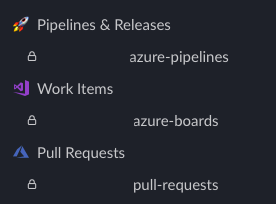
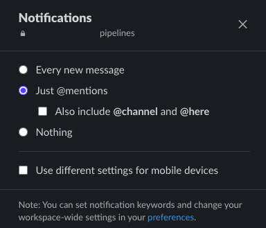
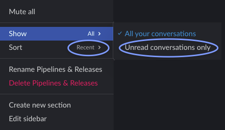

## Noise

Slack can be a really effective tool with asynchronous work, but the defaults aren't great out of the box.

I want to get you a few tips on how to use Slack effectively.

Piping through release notifications, work-item updates, alerts and more can help you reduce context switching with other tools, but without proper control you'll likely find it overwhelming.

## Sections

Use sections to organize your content and customize the level of priority you want to assign to the grouped channels.

This is for paid plans. This guide assumes you are on company plan with those features.

## Individual Channel Settings

Reduce noise from busy channels, especially when folks over-use `@here`

Configure settings (especially in automated or busy rooms) to:

- mute notifications
- mute `@here` if this is not properly used in the room.
- You'll still get notified if your name is mentioned, but otherwise the channel won't keep showing up as needing your attention.

## Change Section Behavior

- Sort by recent activity
- Set your section to only show unreads + sort by recent updates. This will keep your sidebar very simple and clean, autohiding after it's been read.

## Flag Keywords

If someone forgets to mention your name with the `@Me` syntax, you can set your name as a keyboard to alert on as a backup.

I set `sheldon` as a keyword, and it helps ensure I get notified even if the alert, message, response didn't properly format my name in the message or by the app integrations (very few map to user id properly).

## Use All Unreads

From your settings for the sidebar, enable the `All Unreads` section.
This can help you quickly review all channel activity in a single pane similar to an email inbox.

## Shortcuts

A couple basic shortcuts will set you up to use Slack effectively.

For Windows, typically replace  `cmd` with `ctrl`.

| Action                 | Keyboard                                                     |
| ---------------------- | ------------------------------------------------------------ |
| `cmd+k`                | Quick switcher for channels and conversations. Don't leave anything pinned you don't need to by using this to flip |
| `cmd+/`                | Keyboard shortcut reference panel                            |
| `cmd+left` `cmd+right` | Navigate similar to a web browser back or forward to whatever converation or channel you were looking at. |
| `cmd+up`               | edit the last message (if you are focused in the textbox)    |
| `option+shift+down`    | go to next unread channel (or use allunreads)                |

## Downtime

Make sure to update your notification window to allow for uninteruppted deep work.
