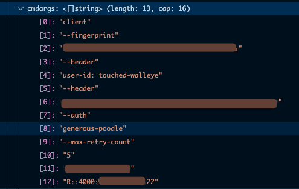
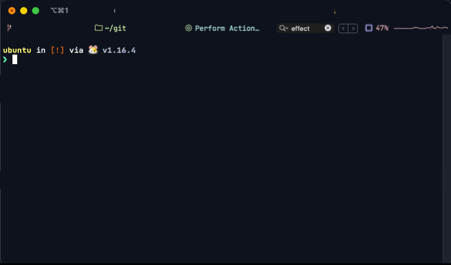

## progress

It was a dark and stormy night.
The world was bleak.
A command was sent to The Compiler.

The assumptions were flawed.
The command was rejected.

> You have given me an invalid command with `-argument-that-shall-not-work 5` being invalid.

But I've provided `--argument-that-shall-not-work`, the indomitable wizard said.

> Your command is unworthy.

Digging into esoteric tomes of knowledge, the wizard discovered others have had similar issues when calling external processes using the legendary wizardry of `os/exec`.
However, none could shine light into the darkness of his failure.

Running in `pwsh` worked fine.

Next, the wizard tried a variety of escaping commands.

- Using `shellescape` package.
- Using back-ticks with the arguments to escape.
- Using partially quoted arguments in the slice of the strings.
- Using no quotes.
- Went down the path of ancient texts describing similar issues.[^similar-issues]

To the wizards dismay, copying the printed debug output worked fine in the terminal, but alas would not be executed by The Compiler.

It began to feel like the curse of dynamic SQL queries that had long plagued the wizard until PowerShell had been discovered.

The wizard ruminated on his plight.
He thought:

> At the end of the day, all things seem to come down to strings and the cursed interpretation of my textual commands to The Compiler.
How many a day have I wasteth upon the fault of a single character.
The root of all evil must be a string."

The wizard connected to a new remote instance, using the power of the Remote SSH plugin and began debugging in VSCode.

The debug breakpoint config that worked was set in stone.

```json
  {
      "name": "Run frustrating-test",
      "type": "go",
      "request": "launch",
      "mode": "debug",
      "program": "${workspaceFolder}/MyTestApp/test.go",
      "args": [
        "-count",
        "100",
        "-batch",
        "10",
        "-delay",
        "1",
        "-server",
        "MyCustomIPAddress",
        "-debug",
      ],
      "debugAdapter": "legacy" // newer version wouldn't work remote
    },
```

Consulting The Sage (aka Debugger), it advised the wizard of the message sent to The Compiler.



The wizard had a revelation.
A fellow wizard advised to break the appending into individual statements instead of trying to do so much in one step.

The incantation changed from:

```go
command = append(command, fmt.Sprintf(`--header "user-id: %s"`, petname.Generate(petNameLength, "-"))
```

to the following:

```go
command = append(command, "--header")
command = append(command, fmt.Sprintf(`user-id: %s`, petname.Generate(petNameLength, "-")))
command = append(command, "--max-retry-count", "5")
```

The foe vanquished, the _The Blight of Strings_ was cast aside with malice.
The wizard swore to never fall prey to this again.



Josesh[^similar-issues] pointed towards: [EscapeArgs](https://github.com/golang/go/blob/8a7ee4c51e992174d432ce0f40d9387a32d6ee4a/src/syscall/exec_windows.go#L26).
I did not find any equivalent for Darwin.
The closest thing I could find was [execveDarwin](https://github.com/golang/go/blob/8a7ee4c51e992174d432ce0f40d9387a32d6ee4a/src/syscall/exec_unix.go#L303) which I believe is the execution line, which gets the argument list from: [SlicePtrFromStrings](https://github.com/golang/go/blob/8a7ee4c51e992174d432ce0f40d9387a32d6ee4a/src/syscall/exec_unix.go#L284) which is defined at [here](https://github.com/golang/go/blob/8a7ee4c51e992174d432ce0f40d9387a32d6ee4a/src/syscall/exec_unix.go#L86)

I'll have to re-examine in the future when I have more experience with Go, as it's not a simple chain to follow. :(fas fa-brain):

```text
[test --param 1]
strings.Join(a)... "test --param 1"
os.Command: ["test" "--param 1"]
echo "test --param 1\n"
```

This pointed towards a similar issue with the `\n` showing up.

:(fas fa-play): [Playground](https://play.golang.org/p/2iNCcDX0dWi)



The Compiler's heartless gaze felt nothing.
In the shadows, _The String Balrock_ bid its time, knowing that the wizard would suffer once again.



<!--  -->
<!-- https://play.golang.org/p/rm9evIsgecS -->

[^similar-issues]: [2016 // Prevent Escaping exec.Command Arguments in Go | Joseph Spurrier](https://www.josephspurrier.com/prevent-escaping-exec-command-arguments-in-go)
